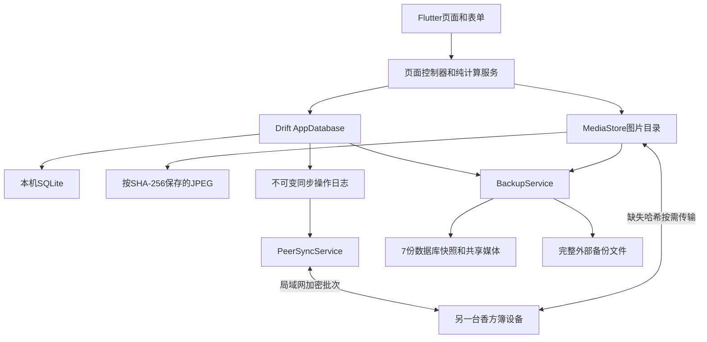

# 香方簿技术实现规划

- 文档状态：已确认；M7已启动并进入性能、内存、存储和交付前回归；M6继续冻结
- 版本：0.15
- 日期：2026-08-10
- 产品依据：`M0_PRODUCT_SPEC.md` 1.2 冻结版
- 本文作用：说明实现语言、架构、数据、同步、备份、依赖、冻结后确认变更和验证方式；新任务先读根目录`README.md`

## 1. 技术结论

| 项目 | 选择 | 原因 |
|---|---|---|
| 客户端语言 | Dart | Flutter原生语言，单一语言完成界面、数据库、计算和局域网逻辑 |
| UI框架 | Flutter稳定版 | Android手机、平板、横竖屏共用一套界面 |
| 首版平台 | Android 10及以上 | 与冻结M0一致，覆盖现代文件、网络和安全能力 |
| 本地数据库 | Drift + SQLite | 类型安全、迁移明确、事务可靠、适合完全离线数据 |
| 图片存储 | 应用文件目录 + SHA-256内容标识 | 图片不塞进数据库，可去重、同步和备份 |
| 状态管理 | Flutter自带StatefulWidget、ValueNotifier、ChangeNotifier和StreamBuilder | 首版数据量和页面复杂度不需要Riverpod、Bloc或Redux |
| 导航 | Flutter原生Navigator和NavigationBar | 三个底部入口，无需路由框架 |
| 局域网发现 | `dart:io` UDP广播 | 不依赖云端和服务发现插件；手动地址后备已冻结，不纳入当前开发范围 |
| 局域网传输 | `dart:io` HttpServer/HttpClient + JSON批次 | 数据规模小，HTTP批次比WebSocket和自定义二进制协议更简单 |
| 同步模型 | 多副本操作日志 + 每设备序号 + 版本冲突保留 | 支持2～3台设备离线、间接传播和无主同步 |
| 备份 | （M6冻结参考）SQLite一致性快照 + 媒体清单 + ZIP完整导出 | M6恢复并重新确认需求后方可实施；冻结期间不新增备份、恢复或ZIP能力 |
| 架构形态 | 本地优先的模块化单体应用 | 不建设服务端、微服务或多层Clean Architecture |

## 2. 本机工具链现状

2026-08-05已完成项目内隔离安装：

- Flutter 3.44.8稳定版，含Dart 3.12.2；
- Eclipse Temurin JDK 17.0.20+8；
- Android SDK Platform 36、Build Tools 36.1.0和Platform Tools 37.0.1；
- Android Emulator 37.1.11和Android 16（API 36）Google APIs x86_64系统镜像；
- `Xiang_API_36`模拟器已完成冷启动验证；
- `flutter doctor -v`无问题。

M1/M4已在真实Android手机完成安装验证；M5真机验收结果单独记录在第11.3节和M5状态中。

当前工具链精确版本以`toolchain.lock`为准；后续升级也必须先更新该锁文件和验证记录，不从旧聊天或本节日期推断版本。

### 2.1 项目内工具链硬约束

开发工具、SDK、依赖、缓存、模拟器和临时文件不得有意写入用户级或系统级目录，统一放在`D:\Xiang`：

```text
D:\Xiang\
  .toolchain\
    flutter\
    android-sdk\
    jdk\
    git\              # 仅在现有Git不可用时加入便携版
  .cache\
    pub\
    gradle\
  .android\           # ADB身份、模拟器配置和AVD数据
  .home\              # 隔离工具仍按用户目录写入的配置
  .tmp\
  .secrets\           # 发布签名，仅本机保存并单独备份
  app\
```

M1创建一个项目脚本，只为当前PowerShell进程设置`HOME`、`USERPROFILE`、`APPDATA`、`LOCALAPPDATA`、`JAVA_HOME`、`ANDROID_HOME`、`ANDROID_SDK_ROOT`、`ANDROID_USER_HOME`、`ANDROID_AVD_HOME`、`ANDROID_EMULATOR_HOME`、`ADB_VENDOR_KEYS`、`PUB_CACHE`、`GRADLE_USER_HOME`、`TEMP`、`TMP`和临时`PATH`，把未明确支持独立路径的工具也兜底导向`.home`。关闭该终端后设置失效，不修改用户或系统环境变量、注册表和全局`PATH`。

执行约束：

- 不使用`winget`、Chocolatey、全局MSI或其他会注册系统级组件的安装方式；
- 不执行全局Dart包安装，项目命令统一使用`dart run`和锁定的本地依赖；
- Android SDK许可、系统镜像、AVD、Gradle分发包、Pub包和ADB身份均保存在上述项目目录；
- Git身份只允许写入仓库级配置，不修改全局Git配置；
- `.toolchain/`、`.cache/`、`.android/`、`.home/`、`.tmp/`和`.secrets/`必须加入`.gitignore`，不得提交大体积工具或密钥；
- 不主动启用或安装全局虚拟化组件；若现有Windows能力无法运行模拟器，先使用USB真机Hot Reload并报告阻塞；
- 若某个工具仍会在项目外产生持久文件，停止使用并先调整路径；无法隔离时向用户说明，不静默写入。操作系统自身不可避免的短期系统记录除外。

## 3. 总体架构



图中的`BackupService`、数据库快照和完整外部备份均为M6冻结前的设计参考，不属于当前实现范围。

### 3.1 代码层级

只保留三层：

1. 页面：显示、输入、导航和短暂UI状态；
2. 功能逻辑：计算、表单控制、同步服务，以及M6恢复后才重新评审的备份服务；
3. 数据：Drift数据库和媒体文件。

不建立：

- 每张表一套Repository接口；
- 单实现UseCase接口；
- Domain/Data/Presentation三份重复模型；
- 依赖注入容器；
- 微服务或本地HTTP业务后端；
- 通用工作流或规则引擎。

### 3.2 建议目录

```text
app/
  lib/
    main.dart
    app.dart
    data/
      app_database.dart
      tables.dart
      media_store.dart
    services/
      formula_calculator.dart
      sync_service.dart
      backup_service.dart
    features/
      home/
      formulas/
      mixing/
      ingredients/
      customers/
      plaques/
      assets/
      settings/
  test/
    formula_calculator_test.dart
    database_test.dart
    sync_test.dart
    backup_test.dart
```

仅当单个文件实际变得难以维护时再拆分，不提前为每个按钮建立独立文件。

## 4. 数据库实现

### 4.1 SQLite原则

- SQLite是业务数据的唯一事实来源；
- Drift数据库运行在后台隔离线程，避免阻塞界面；
- 启用外键；
- 使用WAL模式；
- 所有跨表操作使用事务；
- 正式香方版本和完成时的快照不可被普通更新覆盖；
- 删除、恢复、完成调配和版本创建必须原子提交；
- 不使用SQLCipher或数据库密码。

### 4.2 公共字段

需要同步的可变实体统一包含：

```text
id                  全局唯一ID
revision_id         当前修订ID
updated_by_device   最后修改设备
updated_at_utc      显示和诊断时间，不用于冲突覆盖
is_deleted          删除状态
deleted_at_utc      删除时间
```

这些重复字段可以使用一个Drift表Mixin复用，因为会被大量数据表共同使用。

### 4.3 表结构

物理表以冻结M0第12节为准，不另造第二套业务模型。1.2 取消`ingredient_skus`和`sku_ratio_overrides`；`ingredients`直接保存图片和备注；推荐配置、草稿、正式香方和调配项目直接引用`ingredient_id`并保存香料文字快照。

重点约束：

- 顾客姓名和电话至少一个非空；
- 比例区间最低值不得大于最高值；
- 推荐配置只属于一个制作类型；
- 香料必须属于一个分类；
- 资产数量只能是非负整数；
- 正式版本写入后不允许原地修改组成；
- 完成调配时保存香料、分类和比例文字快照；
- 本机设置和私有设备凭据不进入业务同步操作。

### 4.4 迁移

- Drift `schemaVersion`每次只递增；
- 常规迁移写明确的前向SQL，不通过删库重建解决；
- 1.2 是用户明确批准的不兼容模型替换：升级到 schema 7 时删除并重建业务表，不迁移旧 SKU、香方、推荐配置、调配记录和相关同步业务数据；数据库生成新本机设备ID时同步删除旧身份文件和私有信任凭据，避免身份不一致导致M5运行时无法启动，设备按新身份重新配对；保留本机工具链与应用代码，不承诺旧业务数据恢复；
- 当前数据库已升级到schema 9：schema 8为香方图片字段，schema 9为推荐香方标记和推荐草稿图片字段；8到9迁移保留已有香方和草稿数据，并有迁移回归测试；
- M6恢复并重新确认需求后，升级前调用备份服务；冻结期间不以该能力作为迁移前置条件；
- 每个迁移至少有一个从上一版本升级并保留数据的测试；
- M6恢复后，迁移失败时恢复升级前快照；
- M1建立第一版稳定schema后才创建Git基线。

## 5. 定点数计算

### 5.1 存储单位

不使用`double`保存或判断业务比例和克重。

```text
比例单位：0.01个百分点
100.00% = 10000

重量单位：0.01g
2.10g = 210
```

界面输入先作为字符串校验，再转换成整数；显示时统一格式化为两位小数。

输入边界统一为：比例和重量不得为负、单项比例不得超过10000、配方比例合计必须为10000、目标总重和最终总重必须大于0；超过两位小数或超出整数存储范围时直接拒绝，不截断、不转成`double`。

### 5.2 计划克重

对于总重量`T`和比例`R`：

```text
numerator = T × R
planned = numerator四舍五入到整数重量单位
```

全部项目初步计算后：

```text
delta = 目标总重量 - 所有计划重量之和
```

把`delta`一次加到计划重量最大的项目；并列时使用持久化列表顺序中的第一项。`delta`可以为正或负，结果不得小于零。列表顺序作为配方项目快照的一部分保存，确保不同设备对相同输入得到相同结果。

### 5.3 实际比例

完成调配后：

```text
final_total = 所有最终重量之和
ratio_i = final_weight_i ÷ final_total
```

每项比例用纯整数四舍五入到0.01个百分点，再把与10000之间的差额一次加到最终重量最大的项目；并列时仍取持久化列表顺序第一项，确保保存比例合计100.00%且各设备结果一致。

### 5.4 纯函数

计算服务只接收整数并返回新结果，不读取数据库、不操作界面：

```text
parseRatio(text)
parseWeight(text)
allocatePlannedWeights(total, ratios)
projectFinalWeights(planned, entered)
calculateFinalRatios(weights)
checkRecommendationRanges(items, ranges)
```

这组函数先于调配界面实现，并使用冻结M0中的10.00g→10.10g实例作为回归测试。

## 6. 图片和文件

### 6.1 导入流程

```text
相机或相册
  → 修正方向
  → 用户拖动和双指缩放裁切（按入口指定宽高比）
  → 最长边1600像素
  → JPEG质量85
  → SHA-256
  → media/<hash>.jpg
```

- 文件写入临时路径；
- 完整写入并校验后再原子改名；
- 数据库只在文件成功后建立引用；
- 相同哈希不重复写入；
- 用户取消或压缩失败时不产生数据库记录；
- 图片选择先限制读取尺寸和质量，再进入交互裁切；裁切结果由`MediaStore`统一修正方向、限制最长边、压缩为JPEG并按SHA-256去重；
- 香方图片点击后进入全屏预览，支持缩放、保存到系统相册和更换图片；无图片时使用名称排版生成占位封面。

### 6.2 清理

M6冻结期间以数据库、草稿、最近删除和未解决冲突快照为引用来源。M6恢复后若仍采用7份快照方案，再把有效备份清单加入引用扫描。数据规模只有几十条，清理时直接扫描引用即可，不维护容易失真的手工引用计数。

满足以下条件才删除媒体文件：

- 当前业务数据未引用；
- 当前草稿和未解决冲突快照未引用；
- 最近删除未引用；
- M6恢复且存在有效备份清单时，所有要求保留的备份均未引用；
- 没有正在进行的写入；刚写入文件额外保护五分钟，避免文件成功后数据库事务尚未提交时被并发清理；
- 遗留的`.<hash>.tmp`中断临时文件可在确认没有同哈希写入后清理；清理失败只记录调试信息，不阻塞应用启动或同步。

## 7. 对等同步实现

这是项目最高风险模块，在M5独立实现和验收，但M1必须预留ID、修订和操作日志字段。

### 7.1 变更日志

每次本地业务写入在同一SQLite事务中：

1. 更新业务实体；
2. 为本设备递增`device_seq`；
3. 写入不可变`sync_operation`。

操作至少包含：

```text
operation_id
origin_device_id
device_seq
entity_type
entity_id
base_revision_id
new_revision_id
operation_kind
payload_json
created_at_utc
```

同步事实由`origin_device_id + device_seq`确定，不依赖可能漂移的手机时间。

### 7.2 间接传播

每台设备保存一个已知位置向量：

```text
设备A已知到A:18, B:9, C:4
```

两台设备连接时先交换位置向量，只发送对方缺失的操作。因此A产生的操作可以先到B，再由B传播到C。

重复操作由`operation_id`忽略，批次应用使用一个事务。

### 7.3 冲突

- 本地修改记录其`base_revision_id`；
- 收到的操作基于当前修订时直接应用；
- 收到的操作基于另一个修订时，不覆盖当前数据；
- 保存当前和传入两个快照到`sync_conflicts`；
- 解决冲突会产生一条新的普通操作并同步给全部设备；
- 不实现字段级自动合并。

保护性重新加入是上述普通冲突规则的例外：隔离操作中新建且设备组内不存在的资料可自动合并；对已有资料的修改即使基于相同旧修订，也必须进入冲突中心，由用户决定结果。

### 7.4 发现和连接

- 应用前台打开一个本机HttpServer；
- UDP广播只发送设备组公共ID、设备ID、端口和短期随机数；
- 不广播顾客或业务数据；
- 发现同组设备后批次交换操作；
- 多台在线设备按设备ID稳定排序后依次同步；
- 小米设备发现同时使用全局广播和当前网段定向广播，提高同一Wi-Fi内发现成功率；
- 应用后台或关闭后停止服务。

### 7.5 配对和传输安全

- 六位配对码短时有效、一次使用并限制失败次数；
- 配对时交换设备身份公钥并由双方确认设备名称；
- 使用成熟加密库完成密钥协商和消息认证，不自写密码学算法；
- 已配对后的同步会话加密并校验消息完整性；
- 正式移除设备后，设备名单拒绝该身份；
- 重新加入产生新配对会话，不复用已撤销凭据；
- M6冻结前规划的外部备份为不加密码；需求恢复时须重新确认，不作为当前实现要求。

具体握手流程在M5开始前先做一个仅连接两台测试设备的技术验证，再接入业务数据。

### 7.6 图片同步

- 操作日志只传图片哈希和元数据；
- 对端缺少某个哈希时再请求文件；
- 文件分块传输；
- 完成后校验大小和SHA-256；
- 校验成功后才移动到正式媒体目录；
- 中断后可重新请求，不把半文件作为成功。

### 7.7 删除清理

- 删除本身是一条同步操作；
- 每台当前成员的位置向量可证明是否收到删除；
- 30天已过、全部当前设备确认且无冲突时，清理业务负载和图片；
- 每个对端、每个操作来源的确认水位持久化到`sync_cursors`，设备最后同步时间持久化到`devices.last_sync_at_utc`；
- 保留最小删除墓碑和压缩后的删除操作，清除业务敏感字段、历史操作及无引用图片；
- 暂时离线设备阻止清理；
- 正式移除设备不再参与确认集合。

### 7.8 保护性重新加入

被移除设备重新配对时：

1. 先上传本机未同步操作到隔离区；
2. 新建且无冲突的实体可以接受；
3. 同ID修改或设备组已不存在的实体进入冲突列表；
4. 用户处理后生成正式操作；
5. 旧设备再接收设备组最新快照和位置向量；
6. 不执行整库覆盖。

### 7.9 批次、依赖和失败控制

- 单个JSON消息上限2 MB，请求超时15秒；
- 每批最多16条同步操作，单次同步最多64轮，可连续传输超过256条操作；
- 发送实体当前快照前检查外键依赖，防止早期草稿操作携带未来才创建的顾客、香方、版本、香牌或其他依赖；跨设备依赖创建可先发送，但同一来源设备始终保持连续水位，不制造序号空洞；
- 同步运行中收到额外请求时最多合并为后续一轮，不并发启动重复整批同步；
- 网络类失败按5秒、15秒、30秒、1分钟、5分钟退避重连；HTTP 4xx、格式、数据库约束等确定性错误暂停该设备自动同步，保留错误提示，等待用户“立即同步”或重新连接；
- 2026-08-09使用Xiaomi 15 Pro与Redmi Pad数据库快照复现并修复`formula_drafts`提前引用未来顾客造成的外键回滚死循环；快照副本可完整回放，未清除真机数据。

## 8. 备份和恢复实现（M6冻结参考）

状态：M6已于2026-08-08冻结，需求暂缓。以下内容只保留为历史候选方案，不据此开发、测试、验收或新增依赖；恢复M6时须重新确认需求与技术方案。

### 8.1 自动备份

- 每天首次启动时检查当天是否已有快照；
- 使用SQLite一致性快照能力生成紧凑数据库副本；
- 快照目录保存数据库文件和媒体哈希清单；
- 图片仍引用共享媒体目录，不复制7份；
- 创建第8份后删除最旧清单和数据库副本，再运行媒体清理；
- 数据库迁移前额外生成不计入日常7份的升级快照。

M6恢复时根据届时的Drift和SQLite接口，在`VACUUM INTO`与官方备份API中重新选择支持最好的一种；不通过直接复制正在写入的WAL数据库冒险。

### 8.2 外部备份格式

使用单个香方簿备份包：

```text
manifest.json
database.sqlite
media/<hash>.jpg
```

`manifest.json`包含格式版本、文件大小和SHA-256。外部包使用ZIP封装但不加密码。

### 8.3 导入事务

1. 导入到临时目录；
2. 校验清单、数据库版本、每个文件大小和哈希；
3. 自动备份当前数据；
4. 关闭数据库写入；
5. 原子替换数据库和媒体索引；
6. 重新打开并执行完整性检查；
7. 失败时恢复导入前备份；
8. 恢复成功后生成新的本机设备身份，并要求重新配对。

## 9. Flutter界面实现

### 9.1 组件

- `MaterialApp`启用Material 3；
- 三项底部导航实现首页、香料、更多；
- 表单使用Flutter标准输入、选择和底部确认组件；
- 数据列表直接监听Drift查询流；
- 页面草稿由轻量控制器自动保存；
- 正常成功状态使用短暂Snackbar或内联状态，不弹模态框；
- 只有破坏性动作、首次超限和同步冲突使用确认界面。
- 页面级弹层入口使用共享动作门闩；门闩在点击处理函数的第一行获取，到异步前置工作和弹层关闭后释放，同一动作期间的后续点击直接返回，避免重复查询后排队打开`showDialog`、`showModalBottomSheet`或重复导航；
- 香料页普通模式保留右下角新增FAB，多选模式隐藏；顶部添加入口和FAB共用同一动作门闩，卡片更多操作保持独立触控区域；
- 资产空状态“添加第一项资产”在点击第一行立即获取页面级门闩，前置分类/状态查询和弹层关闭完成前忽略后续点击；
- 根页面使用`PopScope`拦截无上一级的系统返回和左滑手势，首次返回通过`OverlayEntry`显示居中的轻量“再按一次退出香方簿”提示，短时间内再次返回后调用系统退出，不显示大确认对话框；Android宿主直接结束当前任务，避免`SystemNavigator.pop`再次分发到根返回回调。
- “同步与设备”直接连接已交付的M5运行时：应用启动后异步初始化，入口显示初始化状态；初始化失败时保留入口并在点按后重试，不使用“后续里程碑”占位；并发初始化复用同一个Future，禁止创建多个同步运行时；
- 香料库使用长按进入选择模式，`Set<String>`保存选中香料ID；批量停用在单事务中逐项写同步操作，批量删除在一次确认后执行；
- 香料页顶部和右下角均可添加，卡片更多按钮与添加按钮保持独立触控区域，不使用互相覆盖的悬浮布局。
- 首页增加调配记录入口，展示最近调配的香方和顾客；调配记录页可按顾客姓名、电话或香方名搜索，长按进入多选并批量删除，系统返回优先退出多选；
- 香方页有全部、自建和推荐香方分类；搜索覆盖香方名称及关联调配记录中的顾客姓名、电话；香方卡片显示备注和顾客摘要；
- 推荐香方与普通香方共用`formulas`、版本和编辑流程，不要求顾客或目标克重；推荐香方在普通列表可见，但只能从“推荐香方”页删除；旧`recommendation_*`表仍保留为历史推荐配置数据和同步兼容结构，不再作为当前推荐香方入口；
- 新建香方先进入编辑页，再由用户进入带图片和分类筛选的香料库多选；选择结果按香料分类顺序和名称拼音排序，返回后立即使用正确顺序；
- 香方、草稿和调配记录均支持长按多选删除；香料多选状态下系统返回只退出多选，不退出页面；
- 香方新建阶段可添加图片；香方详情显示图片、比例、香料目录、备注和调配记录，主操作文案为“开始调配”；
- 首页合香珠 / 香牌图片及成品选择图片支持直接双指缩放；缩放在仍有手指触摸时保持，全部松开后恢复；香方图片使用全屏相册式预览；
- 调配页提高计划克重信息层级；未填写实际克重时提示并允许按计划值补全；已有香方开始调配时既可选择已有顾客，也可新建顾客；
- 应用启动前的数据库初始化与媒体目录初始化并行执行；首帧只构建当前首页，另外两个根页面在用户首次访问时才构建，并在首帧后异步初始化同步运行时。后续开发不得把隐藏根页面、同步网络启动或其他非首屏工作重新放回首帧前串行执行；
- 底部导航保留圆角、边框、阴影和近不透明白色外观，但不使用`BackdropFilter`或大半径实时背景模糊，避免高刷新率设备滚动时持续增加GPU合成压力；
- Flutter全局解码图片缓存上限为200张和64 MB；香料网格当前使用`cacheWidth: 480`，香方、推荐香方、成品目录及其他图片列表按实际显示尺寸设置解码宽度；详情、预览和导出等确实需要清晰原图的页面不受此限制；
- 三张首页大图从总计约6.95 MB的无透明PNG转换为质量90 JPEG，总计约0.95 MB，并按1024px宽度解码；
- 滚动列表中新增图片时必须根据展示尺寸设置解码尺寸，不得默认把最长边1600px的存储原图全部按原尺寸解码；
- 以上性能约束自提交`e4a4302`起属于后续开发基线。只有Profile或Release构建的真机证据证明不适用时才调整，不因视觉偏好恢复实时模糊或首帧同步加载隐藏页面。

### 9.2 自适应

- 使用`LayoutBuilder`和约束宽度，不创建手机和平板两套页面；
- 窄屏使用单列；
- 宽屏在确实有价值时使用列表/详情双栏；
- 旋转屏幕后保留草稿和滚动位置；
- 不添加平板专属业务功能。

### 9.3 视觉流程

M4开始前重新检索成熟设计插件和Skill，只选择一个主要设计Skill和一个原型/验收工具。当前已安装的可视化能力可以先做候选稿；用户确认的新建香方、调配和香料库原型成为唯一视觉依据。

## 10. 依赖边界

### 10.1 计划使用

| 依赖 | 用途 |
|---|---|
| `drift`、`drift_flutter` | SQLite访问、监听、事务和迁移 |
| `path_provider`、`path` | 应用目录和安全路径拼接 |
| `image_picker` | 相机和相册选择 |
| `crop_your_image` | 用户拖动、双指缩放和固定宽高比裁切 |
| `image` | 自动方向、缩放和JPEG压缩 |
| `lpinyin` | 同一香料分类内按名称拼音稳定排序 |
| `file_selector` | （M6冻结参考）Android系统文件选择和导入导出位置 |
| `archive` | （M6冻结参考）完整外部备份ZIP |
| `cryptography` | SHA-256校验、配对、会话加密和消息认证 |

开发依赖：

| 依赖 | 用途 |
|---|---|
| `drift_dev`、`build_runner` | Drift代码生成 |
| `flutter_lints` | 官方静态规则 |
| Flutter自带`test`和`integration_test` | 单元、Widget和真机流程测试 |

SQLite运行依赖按M1当日Drift官方推荐选择，避免同时加入重复的SQLite原生库。

### 10.2 明确不使用

- Riverpod、Bloc、Redux；
- GetX；
- go_router；
- Dio或额外HTTP框架；
- Shelf服务端框架；
- Firebase、Supabase或任何云SDK；
- Freezed和多层DTO生成；
- protobuf或自定义二进制协议；
- SQLCipher；
- 自研图标库或设计系统包。

离线ID使用`Random.secure`生成128位随机值并以固定十六进制格式保存，不为此单独引入UUID包。依赖按里程碑加入：M1为SHA-256加入`cryptography`，M5直接复用它完成会话加密；M6冻结期间不加入ZIP或其他备份专用能力，恢复并重新确认方案后再决定。只有现有方案被实际证据证明不足时才新增依赖。

## 11. 质量与验证

### 11.1 每次提交前

```text
dart format --output=none --set-exit-if-changed .
flutter analyze
flutter test
flutter build apk --debug
```

发布候选再执行：

```text
flutter build apk --release
adb install -r <apk>
```

性能问题不得使用Debug APK作结论。日常功能调试可以继续使用Debug和Hot Reload；启动、滚动和帧表现至少使用Profile构建复现，交付前使用Release构建复核。

### 11.2 最小测试集

- 计划克重取整和差额分配；
- 10.00g计划变成10.10g后的最终比例；
- 推荐区间首次提醒和不重复提醒；
- 顾客姓名或电话约束；
- 正式版本不可原地修改；
- 数据库迁移保留数据；
- 图片哈希去重和无引用清理；
- 未解决冲突和刚写入图片不得被清理，中断临时文件应被清理；
- 三个内存副本按不同顺序交换操作后收敛；
- 同一实体并发修改产生冲突而非覆盖；
- 删除经过中间设备传播；
- 被移除设备保护性重新加入；
- 当前快照不得把未来外键依赖注入更早操作；跨设备依赖创建必须先于引用实体且不破坏同源连续水位；
- 永久同步错误暂停自动重试，网络错误退避，避免定时器和本地变更监听形成重试风暴；
- （M6恢复后）备份导出、损坏拒绝和完整恢复；
- （M6恢复后）APK升级保留数据。

### 11.3 真机

- 推荐验证范围为至少两台真实Android设备，并覆盖普通Wi-Fi、热点和离线后重连；三副本间接传播可以由模拟器测试补足；
- M5真机验收已由用户确认通过；当次验收的设备数量、热点组合、离线时长和采集材料未单独记录，因此不把推荐范围追记为已经执行的事实；
- 后续回归应记录设备型号、Android版本、构建模式、网络组合、关键结果和错误日志，便于问题复现；
- 2026-08-09 Redmi Pad已覆盖安装Debug build number 4011并启动验证，启动后未发现崩溃、外键失败或同步重试风暴；
- Xiaomi 15 Pro曾通过ADB连接并提供同步故障数据库快照，最终4011安装阶段从Windows USB/ADB列表消失；仍需重新连接、覆盖安装4011并与Redmi Pad完成双机自动发现、278条历史操作同步和卡顿回归；
- 当前`release`构建仍使用调试签名。用户已确认正式应用ID保持`com.example.xiangfangbu`、版本名保持`1.0.0`，不再作为占位值处理；当前包只用于Release模式性能和功能冒烟，不是M7正式签名交付包。

### 11.4 2026-08-09简单性能优化基线

- 已合入：初始化并行、首帧后预热隐藏根页面、移除底部导航实时模糊、香方网格卡片按720px宽度解码；
- 未改业务数据、同步协议、计算规则、数据库schema和页面操作流程；
- Android 16（API 36）x86_64模拟器、Profile构建冷启动：优化前5次中位数1059ms，最终精简版7次中位数1053ms，差异处于模拟器抖动范围，不宣称启动耗时已有显著下降；
- 最终Release模式构建在同一模拟器安装成功，5次冷启动中位数1015ms；首页、底部导航和推荐香方空页面冒烟通过；
- `dumpsys gfxinfo`在当前Flutter/Impeller Profile进程返回0帧，该帧数据无效，不作为流畅度改善证据；
- 该性能基线建立时为92项测试；当前最新维护基线已增至104项，见第17节；
- 推荐香方列表目前仍保留逐条读取摘要的查询实现。批量联合查询改动范围较大，本轮已明确暂缓；只有真实几十条香方数据仍可稳定复现进入慢或滚动卡顿时，再用Perfetto或查询计时支持后实施。

### 11.5 M7性能与存储验证

- M7可重复Profile用例创建60条图片香料并往返滚动12次，业务数据使用内存数据库和临时媒体目录；
- Android 16模拟器有效样本493帧：Build p90 0.747 ms、p99 1.685 ms，Raster p90 4.207 ms、p99 5.922 ms，最慢Raster 14.194 ms，Build和Raster超预算计数均为0；证据为`.qa/m7/m7-performance-480.json`；
- Redmi Pad `22081283C`、Android 14、Profile第二次有效样本499帧：Build p90 3.792 ms、p99 8.672 ms、最慢11.011 ms，Raster p90 7.136 ms、p99 8.779 ms、最慢9.684 ms，两个超预算计数均为0；证据为`.qa/m7/redmi-pad-profile/m7-performance-480-run2.json`；
- Mi 10 `23b5b05`、Android 13、真实数据库8轮根导航切换在修复前Build p90 20.981 ms、p99 30.767 ms、最慢33.253 ms，共22个Build超预算帧；Raster p99 12.042 ms且无Raster超预算帧。根因是三个已访问根页面随底栏索引变化一起重建；缓存根页面实例后，Build p90 7.070 ms、p99/最慢7.987 ms，Raster p90 9.190 ms、p99/最慢13.692 ms，两个超预算计数均为0，真实设备身份和授权关系断言通过；证据为`.qa/m7/mi10-release-4707/`；
- 最终Release 4707在Mi 10与Redmi Pad均使用`adb install -r`保留数据覆盖成功。5次冷启动中位数分别为833 ms与1063 ms；5轮前后台后Mi 10 `TOTAL PSS`从160902 KB降至142064 KB，Redmi Pad从175639 KB增至182090 KB，均保持1个Activity且View数量不增长。两台日志均未见应用ANR、崩溃、SQLite约束错误或媒体清理失败；短样本只用于确认没有持续增长趋势，不替代长期店内试用；
- 模拟器单次前后PSS快照约下降8%，只作支持性证据，不外推为真机稳定降幅；
- `flutter drive`在版本冲突和测试收尾时可能卸载基础包名，即使测试目标使用包名后缀也不能视为充分隔离。有业务数据的真实设备禁止直接运行自动`flutter drive`；只能先确认可恢复快照，再使用明确构建号、`adb install -r`和人工受控操作。模拟器或无业务数据专用设备可继续运行自动Profile用例；
- 本次工具卸载后，Redmi Pad使用同日只读副本恢复schema 9数据库、原设备ID、信任文件和同步水位，逐文件SHA-256校验一致，随后升级至Release 4707；同步页确认仍为原Redmi Pad设备ID并保留Xiaomi 15 Pro授权关系。Mi 10升级前完整私有数据快照与SHA-256保留在`.qa/m7/mi10-pre4706/`，媒体从28个文件清理为2个仍被引用文件，约释放5 MB；两张业务图片在升级前已经缺失，不是本轮清理造成。上述事件均不等同于M6备份恢复功能完成。

## 12. 分里程碑实现

### M1：工程和本地数据基础

- 在`D:\Xiang`内安装并验证隔离的Flutter、JDK、Android SDK和模拟器工具链；
- 创建进程级开发环境脚本并验证用户目录没有新增依赖或大体积缓存；
- 创建`D:\Xiang\app`；
- 设置Android 10最低版本和发布应用ID占位；
- 只加入M1实际使用的依赖；
- 建立Material 3外壳和三项导航；
- 建立Drift迁移框架、公共同步字段和`production_types`首个纵切；
- 建立本机设备身份和本地操作日志写入；
- 建立MediaStore；
- 完成本地数据库和媒体测试；
- 初始化Git并提交M1基线；
- 不开发业务CRUD页面和真实同步。

### M2：资料库

- 制作类型、分类、单层香料、区间、推荐配置；
- 香牌、顾客、资产分类、状态和资产；
- 搜索、筛选、停用（顾客除外）和最近删除基础；
- 每次保存同时写操作日志；
- 真实图片导入。

### M3：香方和调配

- 纯整数计算服务和测试；
- 新建、已有香方和顾客上次香方；
- 草稿、调配、系统补全、最终比例；
- 顾客使用历史；
- 正式版本和修改历史。

### M4：视觉和自适应

- 搜索成熟设计工具；
- 生成三个关键页面候选原型；
- 用户确认一版；
- 实现并验证手机、平板和横竖屏；
- 不以主观“AI味”反复打回已确认实现。

### M5：对等同步

- 状态：已开发并验收完成；模拟验收已通过，真机验收由用户确认通过，具体网络组合未单独记录；
- 先验证发现、配对和加密会话；
- 操作交换、间接传播和图片传输；
- 冲突中心；
- 删除确认水位；
- 设备移除和保护性重新加入；
- 全业务资料自动同步，保存后即时同步，60秒定时兜底同步；
- 同步批次和失败控制按第7.9节执行，确定性错误暂停自动重试，网络错误指数退避；
- 自动同步不阻塞手动同步按钮，有实际传输或手动零改动时显示完成提示；
- 真机验收范围以用户实际确认结果为准，不补写未单独记录的设备数量、热点或网络组合。

### M6：备份恢复（已冻结，需求暂缓）

- 状态：2026-08-08起冻结；当前不开发、不测试、不验收，也不新增备份专用依赖；
- 恢复条件：用户明确解除冻结，并重新确认M6需求、范围和验收标准；
- 以下为冻结前规划，仅供恢复评审参考：

- 每日7份数据库快照；
- 共享媒体引用和清理；
- 完整ZIP导出；
- 校验、替换、回滚和新设备身份；
- 升级前备份和升级测试。

### M7：交付

- 状态：用户于2026-08-09明确启动；M6继续冻结，本次决定取代原“M6冻结期间不进入M7”的门禁；当前重点为性能、内存、存储和正式交付前准备，尚未完成正式交付；

- 全量回归；
- 性能、磁盘和异常退出检查；
- 真实店内数据试用；
- 生成并验证签名APK；
- 记录版本、签名保管和升级方法。
- M7性能与存储门禁已完成模拟器、Redmi Pad及Mi 10真机短流程验证；用户已确认正式应用ID保持`com.example.xiangfangbu`、版本名保持`1.0.0`，当前交付构建号为4707；正式完成仍包括持续真实店内数据试用、非调试密钥签名和密钥备份策略。

## 13. 主要风险

| 风险 | 等级 | 控制方式 |
|---|---|---|
| 无主对等同步及间接传播 | 高 | 操作日志、设备序号、三副本模拟、独立M5验收 |
| 六位码配对与局域网数据安全 | 高 | 成熟加密库、短时码、限速、先做握手验证 |
| 删除清理与长期离线设备 | 高 | 当前成员确认水位、正式移除、保护性重新加入 |
| 导入或迁移造成数据丢失 | 高 | 导入前备份、临时目录、校验、原子替换和回滚 |
| 图片重复占用空间 | 中 | 内容哈希、共享媒体、备份清单和引用扫描 |
| 内部7份快照与当前数据共享同一媒体文件 | 中 | 避免7倍空间，但不能抵御同一物理文件损坏；人工完整外部备份保留独立图片副本 |
| 不同Android厂商对UDP发现的限制 | 中 | 应用前台运行、批次重试和真实品牌手机验收；手动地址后备已冻结 |
| 横屏和平板布局漂移 | 中 | 单一自适应布局、三个关键页面原型和真机截图 |
| 技术方案过度复杂 | 中 | 模块化单体、Flutter原生能力优先、逐里程碑提交 |

## 14. 当前状态

技术方案已确认，M1至M5、1.2结构优化、首轮简单性能优化和2026-08-09维护迭代均已开发并验证。用户已明确启动M7；M6仍冻结且不恢复开发，M7当前正在进行性能、内存、存储和交付前回归，正式签名交付尚未完成。

- 项目内隔离工具链和`Xiang_API_36`模拟器已安装并验证；
- `dev.ps1`只修改当前PowerShell进程，未修改全局环境；
- 精确版本记录在`toolchain.lock`；
- `D:\Xiang\app`已创建，Android最低版本为API 29；
- Material 3三项导航、Drift schema 9、制作类型、本机身份、操作日志和MediaStore已实现；
- M2原版及1.2结构优化已完成：当前为单层香料，已删除 SKU 和 SKU 推荐覆盖，香料直接保存图片，推荐配置与香方直接选择香料；
- M3及后续维护已完成：编辑阶段自动保存和恢复、纯整数计算、香方草稿和正式版本、推荐香方、新建/重复/旧版本/顾客上次比例调配、系统补全、输入后即时推荐区间提醒、顾客历史、调配修改历史和记录复制已实现；
- M4已完成：Apple风格视觉规范、三个关键页面原型、图片主导大卡片、表单间距与备注对齐、删除撤销和保存状态等核心交互，以及手机/平板横竖屏自适应布局已实现并验收；
- M5已完成：UDP发现、一次性PIN配对、认证加密、对等双向同步、三副本间接传播、图片传输、冲突双方快照与冲突中心、设备移除/撤销、保护性重新加入和隔离区已实现；自动同步采用保存后即时触发加60秒兜底定时同步；
- M5删除确认水位、30天后业务负载与无引用图片清理、最小删除墓碑，以及设备最后同步时间持久化已实现；
- 当前`flutter analyze`、`git diff --check`和Flutter全量107项测试通过；M7 Profile/Release构建、模拟器、Redmi Pad及Mi 10真机帧测试通过；
- M1/M4已在小米Android 16真机完成安装、启动、完整调配集成测试和人工冒烟验收。
- M5真机验收已由用户确认成功；原“进入M6备份恢复开发”的结论已由后续冻结决定取代。
- 2026-08-09简单性能优化已通过提交`e4a4302`并入开发基线；后续功能和修改均在该优化上继续，不得无证据恢复首帧隐藏页同步构建、底部导航实时模糊或列表原图全尺寸解码；
- 2026-08-09维护提交`ac2dd15`加入图片交互裁切、香方图片全屏操作、推荐香方统一流程、香方/草稿/调配记录多选、首页调配记录和同步稳定性修复；
- Redmi Pad与Mi 10当前均已保留数据安装Release 4707；Mi 10真实数据库根导航性能、设备身份、授权关系、前后台与异常日志回归通过；
- `CN=sexy66, C=CN`正式证书已接入Gradle，Release 4707签名APK通过APK Signature Scheme v2校验；应用ID和版本名已由用户确认不变。Xiaomi 15 Pro完整数据已导出至U盘并逐文件校验。现有真机仍安装Android Debug证书版本，Android不允许使用无关联的新证书直接覆盖，数据保留迁移与升级交付仍是进行中的M7门禁。

## 15. M0冻结后的确认变更

以下内容不回写冻结的`M0_PRODUCT_SPEC.md`，以本技术计划记录用户在M5开发和验收期间确认的后续决定：

- 2026-08-08：手动输入设备地址作为自动发现后备的需求冻结，不再开发；
- 2026-08-08：同步成功提示不再完全静默。有新资料传输完成时显示短暂“同步完成”提示；零改动时仅手动同步显示提示，自动同步不使“立即同步”按钮变灰；
- 2026-08-08：M6备份恢复里程碑冻结，M6需求暂缓。冻结期间不开发、不测试、不验收、不新增备份专用依赖；冻结前方案仅作历史参考。恢复M6须由用户明确解除冻结并重新确认需求、范围和验收标准，M7在此期间不启动。
- 2026-08-08：产品基线升级至1.2。直接删除 SKU 模型；`合香珠`与`香牌`合并为`合香珠 / 香牌`制作类型；香料库增加长按多选删除和停用；所有弹层入口统一防重复打开；用户明确不需要旧版业务数据兼容，schema 7 直接重建业务表。
- 2026-08-08：修正M5入口回归。“同步与设备”不得再显示为后续里程碑；同步运行时初始化可重试且并发调用只执行一次。弹层防重入前移到点击动作开始处，覆盖弹层前异步查询。
- 2026-08-08：修正交互回归。恢复香料库右下角新增FAB；资产首项添加增加点击即锁定，避免快速点击延长弹层；根页面左滑返回改为轻量“再按一次退出香方簿”提示，短时间内再次返回才退出。
- 2026-08-09：用户确认首轮简单性能优化应并入开发流程。初始化并行、首帧后预热、移除底栏实时模糊和香方卡片缩略解码成为后续开发基线；复杂数据库查询重构暂缓，小米15 Pro Release模式真机复核待执行。
- 2026-08-09：用户将“推荐配置”产品入口改为“推荐香方”。推荐香方使用正常香方的新建、图片、香料与比例流程，不在创建阶段设置克重或关联顾客；普通香方页可查看推荐香方，但删除只能在推荐香方页执行。
- 2026-08-09：首页增加调配记录入口；调配记录显示对应香方图片，可按顾客姓名、电话或香方名称搜索，并支持长按多选删除。香方和未完成草稿也支持长按多选删除。
- 2026-08-09：新建香方可直接选择图片；香方图片点击后进入全屏缩放页，可保存到相册或更换。所有业务图片导入改为用户可拖动、双指缩放的交互裁切。
- 2026-08-09：首页合香珠 / 香牌和成品选择图片采用直接双指缩放，不经过预览按钮；仍有手指触摸时保持放大，全部松开后恢复。
- 2026-08-09：同步故障维护。修复当前快照把未来顾客外键注入早期草稿操作造成事务回滚的问题；增加跨设备依赖排序、批次限制、请求超时和失败退避，确定性错误暂停自动同步，避免应用持续卡顿。
- 2026-08-09：用户明确启动M7，并要求为最终开发完成做准备，重点优化性能、内存和存储，不能接受卡死或掉帧。该决定取代原“M6冻结期间不进入M7”门禁，但不解除M6冻结，也不表示正式签名交付已经完成。

## 16. 1.2结构优化实施与验收（已完成）

已按以下顺序完成：

1. 先更新产品基线与本技术计划；
2. 调整 Drift schema，删除 SKU 表和引用，生成 schema 7；
3. 重写香料、推荐配置、香方和调配为直接引用香料；
4. 合并默认制作类型，并扫描首页、筛选、推荐配置、历史和设置中的旧文案与分支；
5. 实现香料长按多选，以及批量停用和删除；
6. 为所有打开弹层的可重复点击入口增加防重入，并为“添加第一项资产”等已复现入口补回归测试；
7. 执行格式化、静态分析、全量测试、Debug APK 构建和模拟器冒烟。

最小验收：

- 数据库和界面中没有 SKU 表、SKU 字段、SKU 推荐覆盖或 SKU 选择入口；
- 新建香料可直接填写名称、选择图片并保存；
- 香料卡片添加与更多按钮在小屏不重叠；
- 长按香料可多选，并一次完成批量停用或删除；
- 默认制作类型只有篆香、线香、合香珠 / 香牌，所有业务页面一致；
- 连续快速点击任何弹层入口只产生一个弹层；
- 该阶段完成时为92项测试；最新维护验证为104项`flutter test`和`flutter analyze`通过，见第17节。

## 17. 2026-08-09维护更新与新任务基线

代码基线：`ac2dd15 feat: refine formula media and stabilize peer sync`。

本轮已完成：

- 图片选择与裁切统一到`lib/ui/image_picker_cropper.dart`，支持拍照/相册、拖动、双指缩放和固定宽高比裁切；
- 香方创建、香方详情、成品目录、首页和调配记录的图片展示及操作按第6、9节更新；
- 推荐香方、香方分类筛选、顾客信息、完整详情、多选删除和开始调配流程完成；
- 调配记录首页入口、图片、精准搜索和多选删除完成；
- 同步批次、消息大小、超时、发现、跨设备外键依赖和失败重试控制完成；
- 使用Xiaomi 15 Pro与Redmi Pad的只读数据库快照回放全部待同步操作成功；临时本机路径诊断测试已删除，永久回归测试保留在`sync_operations_test.dart`与`peer_sync_network_test.dart`。

最新验证：

- `flutter test -r compact`：104项通过；
- `flutter analyze`：无问题；
- `git diff --check`：通过；
- `flutter build apk --debug --build-number 4011`：成功；
- Redmi Pad `22081283C`：覆盖安装4011成功，保留用户数据，启动日志未见`MissingLibraryException`、外键失败或重复同步错误；
- Xiaomi 15 Pro `2410DPN6CC`：最终安装和双机回归未完成，原因是设备从Windows USB/ADB列表消失，不是已确认的应用连接失败。

下一次同步任务应从“让Xiaomi 15 Pro重新出现在`adb devices -l`并覆盖安装4011”继续，不要重新清库、撤销授权或重复配对；安装后同时启动两端，验证自动发现、历史操作同步完成、无每数秒重试，并记录日志与帧表现。

## 18. M7性能、存储与交付前准备（进行中）

本轮代码改动：

- 根导航页面改为首次访问时构建并缓存实例，避免启动后立即常驻三个完整页面，也避免每次切换底栏时让所有已访问根页面重建；
- Flutter图片缓存限制为200张和64 MB，所有高频图片列表补充目标尺寸解码；
- 三张首页PNG转换为JPEG，静态资源体积约减少86%；
- MediaStore增加无引用JPEG和中断临时文件清理，并保护当前引用、草稿、最近删除、冲突快照、正在写入和五分钟内新写入图片；
- SQLite设置8 MiB日志保留上限；
- 新增可重复Profile长列表性能用例和媒体清理回归测试。

最新验证与材料：

- `dart format --output=none --set-exit-if-changed lib test integration_test test_driver`：通过；
- `flutter analyze`：通过；
- `flutter test -j 1`：107项通过；Windows并行测试可能因环回网络竞争出现errno 1231，顺序执行通过；
- 模拟器、Redmi Pad与Mi 10 Profile帧结果见第11.5节；Mi 10修复前22个Build超预算帧，修复后Build与Raster超预算均为0；
- 最终Profile 4707约99.0 MB，最终Release 4707约68.1 MB；两台真机均已保留数据覆盖安装并完成冷启动、前后台、内存对象数和异常日志冒烟；
- 最终产物与SHA-256位于`.qa/m7/final-4707/`。`CN=sexy66, C=CN`正式证书已接入Gradle，Release 4707通过APK Signature Scheme v2校验；Xiaomi 15 Pro完整数据已导出至U盘`F:\Xiang-备份\xiaomi15pro-20260810-085903`并逐文件校验。

未完成门禁：

- 真实店内数据量的持续试用和更长时段内存采样，确认长时间图片浏览、编辑与同步后没有持续增长；
- 将`.secrets/sexy66-release.jks`及对应随机密码文件制作至少一份脱离本机的加密备份；
- 确认从现有Android Debug证书安装迁移到`sexy66`证书且保留业务数据的交付方案，并验证升级路径。M7在这些门禁完成前不得标记为交付完成。
