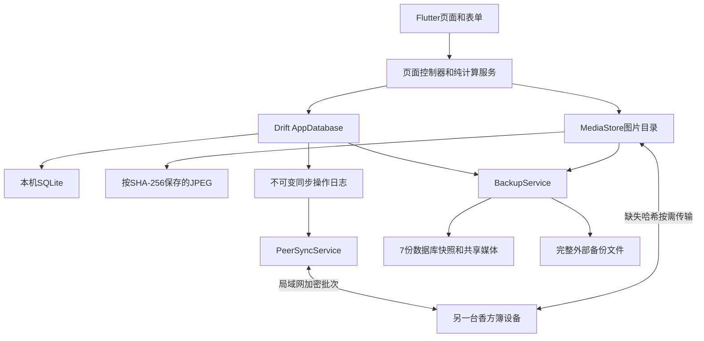

# 香方簿技术实现规划

- 文档状态：已确认；M1/M2开发完成，M1 Android 10真机安装待验收
- 版本：0.5
- 日期：2026-08-05
- 产品依据：`M0_PRODUCT_SPEC.md` 1.1 冻结版
- 本文作用：说明实现语言、架构、数据、同步、备份、依赖和验证方式，不修改M0产品范围

## 1. 技术结论

| 项目 | 选择 | 原因 |
|---|---|---|
| 客户端语言 | Dart | Flutter原生语言，单一语言完成界面、数据库、计算和局域网逻辑 |
| UI框架 | Flutter稳定版 | Android手机、平板、横竖屏共用一套界面 |
| 首版平台 | Android 10及以上 | 与冻结M0一致，覆盖现代文件、网络和安全能力 |
| 本地数据库 | Drift + SQLite | 类型安全、迁移明确、事务可靠、适合完全离线数据 |
| 图片存储 | 应用文件目录 + SHA-256内容标识 | 图片不塞进数据库，可去重、同步和备份 |
| 状态管理 | Flutter自带StatefulWidget、ValueNotifier、ChangeNotifier和StreamBuilder | 首版数据量和页面复杂度不需要Riverpod、Bloc或Redux |
| 导航 | Flutter原生Navigator和NavigationBar | 三个底部入口，无需路由框架 |
| 局域网发现 | `dart:io` UDP广播，手动地址作为后备 | 不依赖云端和服务发现插件 |
| 局域网传输 | `dart:io` HttpServer/HttpClient + JSON批次 | 数据规模小，HTTP批次比WebSocket和自定义二进制协议更简单 |
| 同步模型 | 多副本操作日志 + 每设备序号 + 版本冲突保留 | 支持2～3台设备离线、间接传播和无主同步 |
| 备份 | SQLite一致性快照 + 媒体清单 + ZIP完整导出 | 可验证、可恢复，不重复保存自动备份图片 |
| 架构形态 | 本地优先的模块化单体应用 | 不建设服务端、微服务或多层Clean Architecture |

## 2. 本机工具链现状

2026-08-05已完成项目内隔离安装：

- Flutter 3.44.8稳定版，含Dart 3.12.2；
- Eclipse Temurin JDK 17.0.20+8；
- Android SDK Platform 36、Build Tools 36.1.0和Platform Tools 37.0.1；
- Android Emulator 37.1.11和Android 16（API 36）Google APIs x86_64系统镜像；
- `Xiang_API_36`模拟器已完成冷启动验证；
- `flutter doctor -v`无问题。

尚待应用工程创建后连接至少一台真实Android手机验证安装。

具体SDK和依赖版本在M1开始当天选择当前稳定版并写入锁文件，不在规划阶段写死容易过期的版本号。

### 2.1 项目内工具链硬约束

开发工具、SDK、依赖、缓存、模拟器和临时文件不得有意写入用户级或系统级目录，统一放在`D:\Xiang`：

```text
D:\Xiang\
  .toolchain\
    flutter\
    android-sdk\
    jdk\
    git\              # 仅在现有Git不可用时加入便携版
  .cache\
    pub\
    gradle\
  .android\           # ADB身份、模拟器配置和AVD数据
  .home\              # 隔离工具仍按用户目录写入的配置
  .tmp\
  .secrets\           # 发布签名，仅本机保存并单独备份
  app\
```

M1创建一个项目脚本，只为当前PowerShell进程设置`HOME`、`USERPROFILE`、`APPDATA`、`LOCALAPPDATA`、`JAVA_HOME`、`ANDROID_HOME`、`ANDROID_SDK_ROOT`、`ANDROID_USER_HOME`、`ANDROID_AVD_HOME`、`ANDROID_EMULATOR_HOME`、`ADB_VENDOR_KEYS`、`PUB_CACHE`、`GRADLE_USER_HOME`、`TEMP`、`TMP`和临时`PATH`，把未明确支持独立路径的工具也兜底导向`.home`。关闭该终端后设置失效，不修改用户或系统环境变量、注册表和全局`PATH`。

执行约束：

- 不使用`winget`、Chocolatey、全局MSI或其他会注册系统级组件的安装方式；
- 不执行全局Dart包安装，项目命令统一使用`dart run`和锁定的本地依赖；
- Android SDK许可、系统镜像、AVD、Gradle分发包、Pub包和ADB身份均保存在上述项目目录；
- Git身份只允许写入仓库级配置，不修改全局Git配置；
- `.toolchain/`、`.cache/`、`.android/`、`.home/`、`.tmp/`和`.secrets/`必须加入`.gitignore`，不得提交大体积工具或密钥；
- 不主动启用或安装全局虚拟化组件；若现有Windows能力无法运行模拟器，先使用USB真机Hot Reload并报告阻塞；
- 若某个工具仍会在项目外产生持久文件，停止使用并先调整路径；无法隔离时向用户说明，不静默写入。操作系统自身不可避免的短期系统记录除外。

## 3. 总体架构



### 3.1 代码层级

只保留三层：

1. 页面：显示、输入、导航和短暂UI状态；
2. 功能逻辑：计算、表单控制、同步和备份服务；
3. 数据：Drift数据库和媒体文件。

不建立：

- 每张表一套Repository接口；
- 单实现UseCase接口；
- Domain/Data/Presentation三份重复模型；
- 依赖注入容器；
- 微服务或本地HTTP业务后端；
- 通用工作流或规则引擎。

### 3.2 建议目录

```text
app/
  lib/
    main.dart
    app.dart
    data/
      app_database.dart
      tables.dart
      media_store.dart
    services/
      formula_calculator.dart
      sync_service.dart
      backup_service.dart
    features/
      home/
      formulas/
      mixing/
      ingredients/
      customers/
      plaques/
      assets/
      settings/
  test/
    formula_calculator_test.dart
    database_test.dart
    sync_test.dart
    backup_test.dart
```

仅当单个文件实际变得难以维护时再拆分，不提前为每个按钮建立独立文件。

## 4. 数据库实现

### 4.1 SQLite原则

- SQLite是业务数据的唯一事实来源；
- Drift数据库运行在后台隔离线程，避免阻塞界面；
- 启用外键；
- 使用WAL模式；
- 所有跨表操作使用事务；
- 正式香方版本和完成时的快照不可被普通更新覆盖；
- 删除、恢复、完成调配和版本创建必须原子提交；
- 不使用SQLCipher或数据库密码。

### 4.2 公共字段

需要同步的可变实体统一包含：

```text
id                  全局唯一ID
revision_id         当前修订ID
updated_by_device   最后修改设备
updated_at_utc      显示和诊断时间，不用于冲突覆盖
is_deleted          删除状态
deleted_at_utc      删除时间
```

这些重复字段可以使用一个Drift表Mixin复用，因为会被大量数据表共同使用。

### 4.3 表结构

物理表以冻结M0第12节为准，不另造第二套业务模型。M1只建立迁移框架、本机设备与操作日志基础、公共同步字段，以及`production_types`首个可运行纵切；其余表在对应功能里程碑加入，并通过前向迁移进入同一数据库。这样能尽早验证真实读写，又不在页面和流程尚未实现时一次性固化全部表。

重点约束：

- 顾客姓名和电话至少一个非空；
- 比例区间最低值不得大于最高值；
- 推荐配置只属于一个制作类型；
- SKU必须属于一条香料记录；
- 香料必须属于一个分类；
- 资产数量只能是非负整数；
- 正式版本写入后不允许原地修改组成；
- 完成调配时保存香料、SKU、分类和比例文字快照；
- 本机设置和私有设备凭据不进入业务同步操作。

### 4.4 迁移

- Drift `schemaVersion`每次只递增；
- 每次迁移写明确的前向SQL，不通过删库重建解决；
- 升级前调用备份服务；
- 每个迁移至少有一个从上一版本升级并保留数据的测试；
- 迁移失败时恢复升级前快照；
- M1建立第一版稳定schema后才创建Git基线。

## 5. 定点数计算

### 5.1 存储单位

不使用`double`保存或判断业务比例和克重。

```text
比例单位：0.01个百分点
100.00% = 10000

重量单位：0.01g
2.10g = 210
```

界面输入先作为字符串校验，再转换成整数；显示时统一格式化为两位小数。

输入边界统一为：比例和重量不得为负、单项比例不得超过10000、配方比例合计必须为10000、目标总重和最终总重必须大于0；超过两位小数或超出整数存储范围时直接拒绝，不截断、不转成`double`。

### 5.2 计划克重

对于总重量`T`和比例`R`：

```text
numerator = T × R
planned = numerator四舍五入到整数重量单位
```

全部项目初步计算后：

```text
delta = 目标总重量 - 所有计划重量之和
```

把`delta`一次加到计划重量最大的项目；并列时使用持久化列表顺序中的第一项。`delta`可以为正或负，结果不得小于零。列表顺序作为配方项目快照的一部分保存，确保不同设备对相同输入得到相同结果。

### 5.3 实际比例

完成调配后：

```text
final_total = 所有最终重量之和
ratio_i = final_weight_i ÷ final_total
```

每项比例用纯整数四舍五入到0.01个百分点，再把与10000之间的差额一次加到最终重量最大的项目；并列时仍取持久化列表顺序第一项，确保保存比例合计100.00%且各设备结果一致。

### 5.4 纯函数

计算服务只接收整数并返回新结果，不读取数据库、不操作界面：

```text
parseRatio(text)
parseWeight(text)
allocatePlannedWeights(total, ratios)
projectFinalWeights(planned, entered)
calculateFinalRatios(weights)
checkRecommendationRanges(items, ranges)
```

这组函数先于调配界面实现，并使用冻结M0中的10.00g→10.10g实例作为回归测试。

## 6. 图片和文件

### 6.1 导入流程

```text
相机或相册
  → 修正方向
  → 中心方形裁剪
  → 最长边1600像素
  → JPEG质量85
  → SHA-256
  → media/<hash>.jpg
```

- 文件写入临时路径；
- 完整写入并校验后再原子改名；
- 数据库只在文件成功后建立引用；
- 相同哈希不重复写入；
- 用户取消或压缩失败时不产生数据库记录；
- 图片处理放到后台Isolate，避免界面卡顿。

### 6.2 清理

以数据库、最近删除和7份备份清单为引用来源。数据规模只有几十条，清理时直接扫描引用即可，不维护容易失真的手工引用计数。

满足以下条件才删除媒体文件：

- 当前业务数据未引用；
- 最近删除未引用；
- 7份备份均未引用；
- 没有正在进行的导出、导入或同步。

## 7. 对等同步实现

这是项目最高风险模块，在M5独立实现和验收，但M1必须预留ID、修订和操作日志字段。

### 7.1 变更日志

每次本地业务写入在同一SQLite事务中：

1. 更新业务实体；
2. 为本设备递增`device_seq`；
3. 写入不可变`sync_operation`。

操作至少包含：

```text
operation_id
origin_device_id
device_seq
entity_type
entity_id
base_revision_id
new_revision_id
operation_kind
payload_json
created_at_utc
```

同步事实由`origin_device_id + device_seq`确定，不依赖可能漂移的手机时间。

### 7.2 间接传播

每台设备保存一个已知位置向量：

```text
设备A已知到A:18, B:9, C:4
```

两台设备连接时先交换位置向量，只发送对方缺失的操作。因此A产生的操作可以先到B，再由B传播到C。

重复操作由`operation_id`忽略，批次应用使用一个事务。

### 7.3 冲突

- 本地修改记录其`base_revision_id`；
- 收到的操作基于当前修订时直接应用；
- 收到的操作基于另一个修订时，不覆盖当前数据；
- 保存当前和传入两个快照到`sync_conflicts`；
- 解决冲突会产生一条新的普通操作并同步给全部设备；
- 不实现字段级自动合并。

### 7.4 发现和连接

- 应用前台打开一个本机HttpServer；
- UDP广播只发送设备组公共ID、设备ID、端口和短期随机数；
- 不广播顾客或业务数据；
- 发现同组设备后批次交换操作；
- 自动发现失败时使用用户输入地址；
- 多台在线设备按设备ID稳定排序后依次同步；
- 应用后台或关闭后停止服务。

### 7.5 配对和传输安全

- 六位配对码短时有效、一次使用并限制失败次数；
- 配对时交换设备身份公钥并由双方确认设备名称；
- 使用成熟加密库完成密钥协商和消息认证，不自写密码学算法；
- 已配对后的同步会话加密并校验消息完整性；
- 正式移除设备后，设备名单拒绝该身份；
- 重新加入产生新配对会话，不复用已撤销凭据；
- 外部备份仍按M0要求保持不加密码。

具体握手流程在M5开始前先做一个仅连接两台测试设备的技术验证，再接入业务数据。

### 7.6 图片同步

- 操作日志只传图片哈希和元数据；
- 对端缺少某个哈希时再请求文件；
- 文件分块传输；
- 完成后校验大小和SHA-256；
- 校验成功后才移动到正式媒体目录；
- 中断后可重新请求，不把半文件作为成功。

### 7.7 删除清理

- 删除本身是一条同步操作；
- 每台当前成员的位置向量可证明是否收到删除；
- 30天已过、全部当前设备确认且无冲突时，清理业务负载和图片；
- 保留最小设备同步水位，不永久保留整条删除数据；
- 暂时离线设备阻止清理；
- 正式移除设备不再参与确认集合。

### 7.8 保护性重新加入

被移除设备重新配对时：

1. 先上传本机未同步操作到隔离区；
2. 新建且无冲突的实体可以接受；
3. 同ID修改或设备组已不存在的实体进入冲突列表；
4. 用户处理后生成正式操作；
5. 旧设备再接收设备组最新快照和位置向量；
6. 不执行整库覆盖。

## 8. 备份和恢复实现

### 8.1 自动备份

- 每天首次启动时检查当天是否已有快照；
- 使用SQLite一致性快照能力生成紧凑数据库副本；
- 快照目录保存数据库文件和媒体哈希清单；
- 图片仍引用共享媒体目录，不复制7份；
- 创建第8份后删除最旧清单和数据库副本，再运行媒体清理；
- 数据库迁移前额外生成不计入日常7份的升级快照。

M1根据当前Drift和SQLite接口，在`VACUUM INTO`与官方备份API中选择支持最好的一种；不通过直接复制正在写入的WAL数据库冒险。

### 8.2 外部备份格式

使用单个香方簿备份包：

```text
manifest.json
database.sqlite
media/<hash>.jpg
```

`manifest.json`包含格式版本、文件大小和SHA-256。外部包使用ZIP封装但不加密码。

### 8.3 导入事务

1. 导入到临时目录；
2. 校验清单、数据库版本、每个文件大小和哈希；
3. 自动备份当前数据；
4. 关闭数据库写入；
5. 原子替换数据库和媒体索引；
6. 重新打开并执行完整性检查；
7. 失败时恢复导入前备份；
8. 恢复成功后生成新的本机设备身份，并要求重新配对。

## 9. Flutter界面实现

### 9.1 组件

- `MaterialApp`启用Material 3；
- 三项`NavigationBar`实现主页、香方、更多；
- 表单使用Flutter标准输入、选择和底部确认组件；
- 数据列表直接监听Drift查询流；
- 页面草稿由轻量控制器自动保存；
- 正常成功状态使用短暂Snackbar或内联状态，不弹模态框；
- 只有破坏性动作、首次超限和同步冲突使用确认界面。

### 9.2 自适应

- 使用`LayoutBuilder`和约束宽度，不创建手机和平板两套页面；
- 窄屏使用单列；
- 宽屏在确实有价值时使用列表/详情双栏；
- 旋转屏幕后保留草稿和滚动位置；
- 不添加平板专属业务功能。

### 9.3 视觉流程

M4开始前重新检索成熟设计插件和Skill，只选择一个主要设计Skill和一个原型/验收工具。当前已安装的可视化能力可以先做候选稿；用户确认的新建香方、调配和香料库原型成为唯一视觉依据。

## 10. 依赖边界

### 10.1 计划使用

| 依赖 | 用途 |
|---|---|
| `drift`、`drift_flutter` | SQLite访问、监听、事务和迁移 |
| `path_provider`、`path` | 应用目录和安全路径拼接 |
| `image_picker` | 相机和相册选择 |
| `image` | 自动方向、方形裁剪、缩放和JPEG压缩 |
| `file_selector` | Android系统文件选择和导入导出位置 |
| `archive` | 完整外部备份ZIP |
| `cryptography` | SHA-256校验、配对、会话加密和消息认证 |

开发依赖：

| 依赖 | 用途 |
|---|---|
| `drift_dev`、`build_runner` | Drift代码生成 |
| `flutter_lints` | 官方静态规则 |
| Flutter自带`test`和`integration_test` | 单元、Widget和真机流程测试 |

SQLite运行依赖按M1当日Drift官方推荐选择，避免同时加入重复的SQLite原生库。

### 10.2 明确不使用

- Riverpod、Bloc、Redux；
- GetX；
- go_router；
- Dio或额外HTTP框架；
- Shelf服务端框架；
- Firebase、Supabase或任何云SDK；
- Freezed和多层DTO生成；
- protobuf或自定义二进制协议；
- SQLCipher；
- 自研图标库或设计系统包。

离线ID使用`Random.secure`生成128位随机值并以固定十六进制格式保存，不为此单独引入UUID包。依赖按里程碑加入：M1为SHA-256加入`cryptography`，M5直接复用它完成会话加密；M6再加入ZIP能力。只有现有方案被实际证据证明不足时才新增依赖。

## 11. 质量与验证

### 11.1 每次提交前

```text
dart format --output=none --set-exit-if-changed .
flutter analyze
flutter test
flutter build apk --debug
```

发布候选再执行：

```text
flutter build apk --release
adb install -r <apk>
```

### 11.2 最小测试集

- 计划克重取整和差额分配；
- 10.00g计划变成10.10g后的最终比例；
- 推荐区间首次提醒和不重复提醒；
- 顾客姓名或电话约束；
- 正式版本不可原地修改；
- 数据库迁移保留数据；
- 图片哈希去重和无引用清理；
- 三个内存副本按不同顺序交换操作后收敛；
- 同一实体并发修改产生冲突而非覆盖；
- 删除经过中间设备传播；
- 被移除设备保护性重新加入；
- 备份导出、损坏拒绝和完整恢复；
- APK升级保留数据。

### 11.3 真机

- 至少两台真实Android设备；
- 第三台可以使用模拟器补足传递测试，但最终M5仍以三台真机为优先；
- 普通Wi-Fi和手机热点各测试一次；
- 测试离线数日后重新同步；
- 使用Android测试能力采集截图、界面树和错误日志；
- 只有截图、数据查询和恢复结果同时成立才报告通过。

## 12. 分里程碑实现

### M1：工程和本地数据基础

- 在`D:\Xiang`内安装并验证隔离的Flutter、JDK、Android SDK和模拟器工具链；
- 创建进程级开发环境脚本并验证用户目录没有新增依赖或大体积缓存；
- 创建`D:\Xiang\app`；
- 设置Android 10最低版本和发布应用ID占位；
- 只加入M1实际使用的依赖；
- 建立Material 3外壳和三项导航；
- 建立Drift迁移框架、公共同步字段和`production_types`首个纵切；
- 建立本机设备身份和本地操作日志写入；
- 建立MediaStore；
- 完成本地数据库和媒体测试；
- 初始化Git并提交M1基线；
- 不开发业务CRUD页面和真实同步。

### M2：资料库

- 制作类型、分类、香料、SKU、区间、推荐配置；
- 香牌、顾客、资产分类、状态和资产；
- 搜索、筛选、停用（顾客除外）和最近删除基础；
- 每次保存同时写操作日志；
- 真实图片导入。

### M3：香方和调配

- 纯整数计算服务和测试；
- 新建、已有香方和顾客上次香方；
- 草稿、调配、系统补全、最终比例；
- 顾客使用历史；
- 正式版本和修改历史。

### M4：视觉和自适应

- 搜索成熟设计工具；
- 生成三个关键页面候选原型；
- 用户确认一版；
- 实现并验证手机、平板和横竖屏；
- 不以主观“AI味”反复打回已确认实现。

### M5：对等同步

- 先验证发现、配对和加密会话；
- 操作交换、间接传播和图片传输；
- 冲突中心；
- 删除确认水位；
- 设备移除和保护性重新加入；
- 2～3台真机验收。

### M6：备份恢复

- 每日7份数据库快照；
- 共享媒体引用和清理；
- 完整ZIP导出；
- 校验、替换、回滚和新设备身份；
- 升级前备份和升级测试。

### M7：交付

- 全量回归；
- 性能、磁盘和异常退出检查；
- 真实店内数据试用；
- 生成并验证签名APK；
- 记录版本、签名保管和升级方法。

## 13. 主要风险

| 风险 | 等级 | 控制方式 |
|---|---|---|
| 无主对等同步及间接传播 | 高 | 操作日志、设备序号、三副本模拟、独立M5验收 |
| 六位码配对与局域网数据安全 | 高 | 成熟加密库、短时码、限速、先做握手验证 |
| 删除清理与长期离线设备 | 高 | 当前成员确认水位、正式移除、保护性重新加入 |
| 导入或迁移造成数据丢失 | 高 | 导入前备份、临时目录、校验、原子替换和回滚 |
| 图片重复占用空间 | 中 | 内容哈希、共享媒体、备份清单和引用扫描 |
| 内部7份快照与当前数据共享同一媒体文件 | 中 | 避免7倍空间，但不能抵御同一物理文件损坏；人工完整外部备份保留独立图片副本 |
| 不同Android厂商对UDP发现的限制 | 中 | 应用前台运行、批次重试、手动地址后备和真实品牌手机验收 |
| 横屏和平板布局漂移 | 中 | 单一自适应布局、三个关键页面原型和真机截图 |
| 技术方案过度复杂 | 中 | 模块化单体、Flutter原生能力优先、逐里程碑提交 |

## 14. 当前状态

技术方案已确认，M1已经开始。

- 项目内隔离工具链和`Xiang_API_36`模拟器已安装并验证；
- `dev.ps1`只修改当前PowerShell进程，未修改全局环境；
- 精确版本记录在`toolchain.lock`；
- `D:\Xiang\app`已创建，Android最低版本为API 29；
- Material 3三项导航、Drift首版schema、制作类型纵切、本机身份、操作日志和MediaStore已实现；
- M2已完成：资料库表结构、v1到v2前向迁移，以及制作类型管理、香料分类、香料、SKU 图片、三层推荐区间、推荐配置编排、香牌目录、顾客资料、资产清点、用户排序和 30 天最近删除恢复已实现；
- 格式检查、静态分析、37项单元/Widget测试、Android Lint、Debug APK构建和API 36空库/图片集成验收已通过；
- M1代码基线已建立，尚待连接真实Android手机验证安装。
